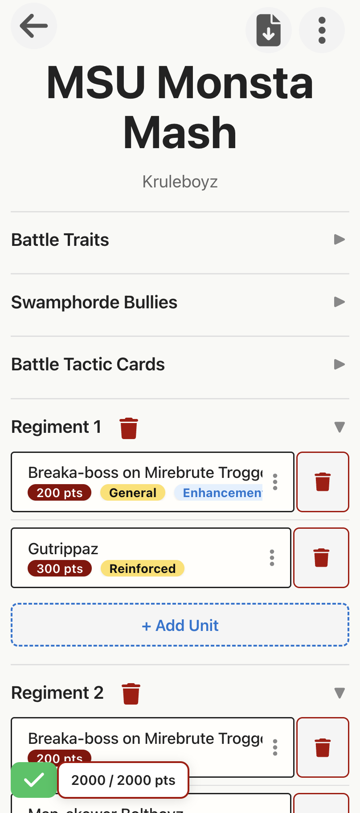
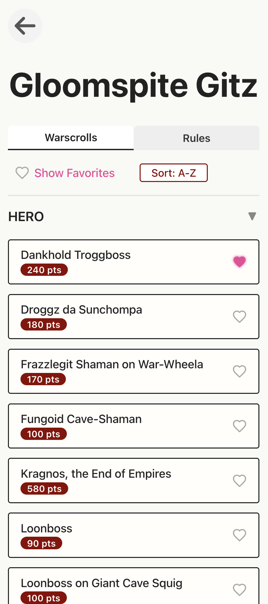
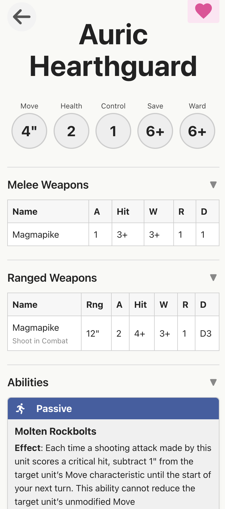

# Sigdex

[**Live Site**](https://sigdex.io)

Sigmar + Pokedex. Sigdex is an Age of Sigmar list builder designed for speed, ease of use, and quick reference. Data is sourced from [BSData](https://github.com/BSData/age-of-sigmar-4th).

<p float="middle">
  
   
  
</p>

## Why Sigdex?
Sigdex aims to make it fast and simple to build lists and reference rules for both you and your opponents. Many existing tools are either locked behind paywalls, cluttered with ads, or not optimized for Age of Sigmar gameplay. Sigdex is free, mobile-friendly, and focused on providing a smooth experience for list building and rules lookup.

## Features
* List building
* Import and exporting lists
* Default weapon settings
* Favoriting armies, lores, units
* Custom list settings like points cap, highlander validation
* QoL warscroll customization like: wards as a stat next to health, summoning ability on the manifestation warscroll, etc.
* Sort by points
* Offline data caching

# Roadmap
* Damage calculator
* PDF parsing for FAQ and core rules abilities
* Full text search on all abilities and warscrolls
* List syncing (cloud or device)

Suggest a feature or report a bug by joining our [**Discord Community**](https://discord.gg/Fn6ZUFb9vZ)

[](https://ko-fi.com/F1F11I630O)


## Development

### Prerequisites
- Node.js (v18+ recommended)
- npm

### Frontend (Vue 3 + Vite + Typescript)

1. Install dependencies:
   ```bash
   npm install
   ```
   This will also set up Husky git hooks for linting and formatting on commit.
2. Start the development server:
   ```bash
   npm run dev
   ```
   The app will be available at [http://localhost:5173](http://localhost:5173) by default.
3. Run tests:
   ```bash
   npx vitest
   ```
4. Lint and format code:
   ```bash
   npm run lint
   npm run format
   ```

### Git Hooks & Husky
- This project uses [Husky](https://typicode.github.io/husky/) to automatically run lint and format checks before commits.
- If you have issues with hooks, run `npm install` again or see Husky docs.

### Common Commands
- `npm run dev` — Start frontend dev server
- `npm run lint` — Run ESLint
- `npm run format` — Run Prettier
- `npx vitest` — Run unit tests

### Project Structure
- `src/` — Vue app source code
  - Main modules:
    - `modules/builder/` — List building, editing, and export features
    - `modules/browser/` — Army/unit browser and reference features
  - Other modules are being migrated to follow this organized structure.
- `public/` — Static assets
- `tests/` — Unit tests

## Disclaimer
Sigdex is an unofficial fan project not afiliated with Games Workshop. All rules and data are sourced from [BSData](https://github.com/BSData/age-of-sigmar-4th) and may not be up-to-date or fully accurate. For official rules and the latest updates, always refer to Games Workshop publications and resources.
